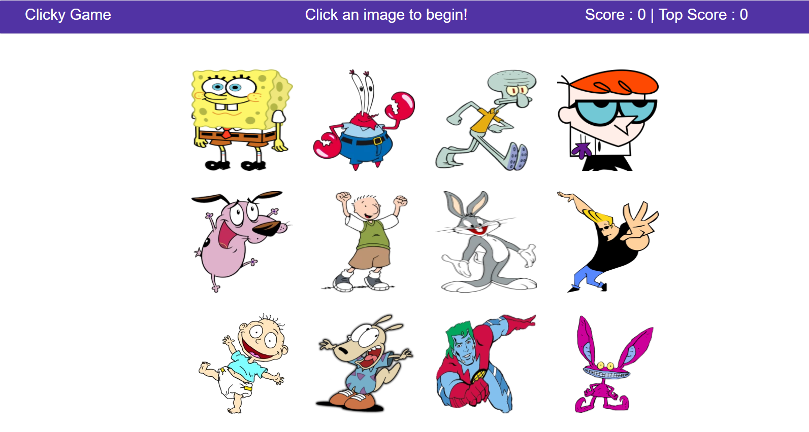
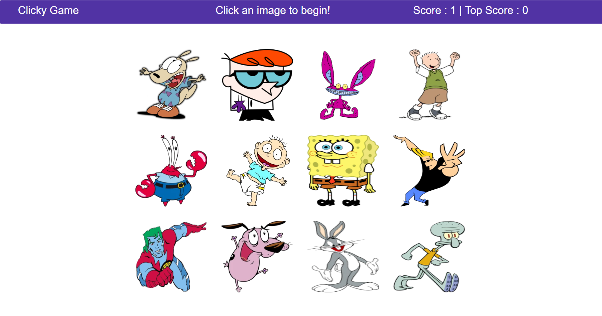
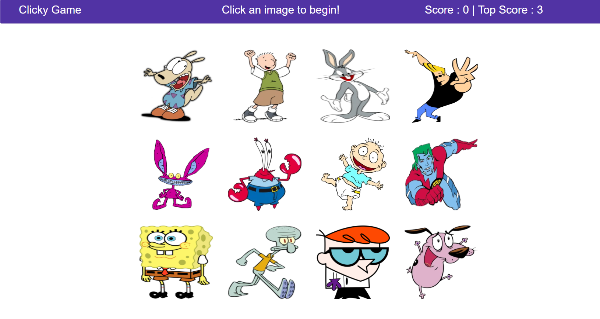

# Clicky Game

This is a memory game created with React.
This application's UIs are broken into components and component states are managed.

### Clicky Game Main View
***

The app displays 12 diffrent images in the beginning.

***

Images are shuffled when the user clicks one image and score incremented by one.

***

If the user click the same image again, the game is over and top score is updated.

